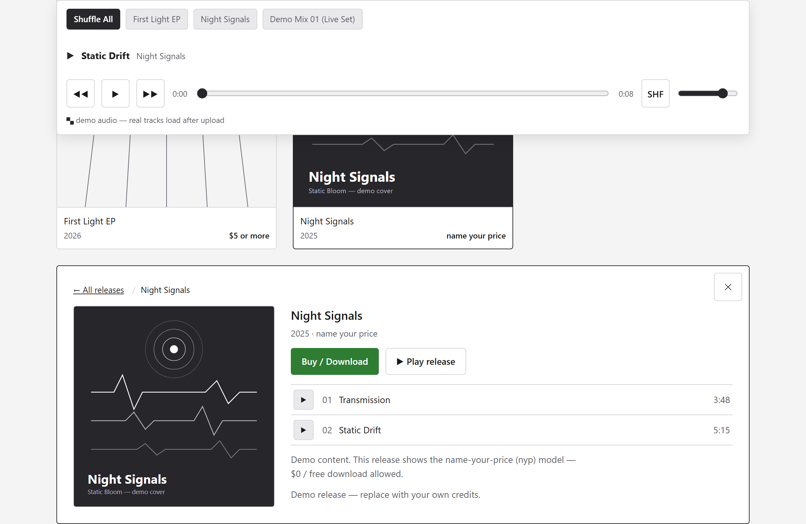

# Decampify



**Build your own music distribution site — simple, free, and serverless.** Decampify is an
open-source template for a self-hosted artist site + digital music store: stream your tracks for
free, sell downloads (WAV/MP3, name-your-price supported), and keep 100% of the relationship with
your fans. No frameworks, no build step, no database, no admin UI, and no server to run or maintain
— the whole catalog lives in a few JSON files, and it runs at **no cost** on free tiers.

**Two ways to set it up:**
- **With a coding agent** — run the included onboarding skill and it walks you through the whole
  setup and launch, step by step.
- **On your own** — just follow [`SETUP.md`](SETUP.md); everything is documented.

**Open source** — free to use, fork, and customize into your own version. Licensed under the
[MIT License](LICENSE).

**Features**

- **Music page** — album grid, expandable release details with track lists, deep links (`#album/<id>`)
- **Stations player** — sticky free-streaming player: Shuffle All, one station per release, one per DJ mix
- **Store** — Stripe Checkout (hosted; no card data touches the site), name-your-price / floor / fixed /
  free price models, WAV or MP3 download choice, whole-release bundle zips
- **Private audio delivery** — Cloudflare R2 bucket, short-lived signed URLs, purchase-gated downloads
- **Press & Videos page** and **EPK page** — both fully data-driven from JSON
- **Mock mode** — the entire site (player + buy flow) runs with **no accounts and no uploaded audio**
- **One-place theming** — all colors and fonts are CSS custom properties in `css/style.css`

**Stack**

| Piece | What it does |
|---|---|
| Static HTML/CSS/JS | `index.html`, `press.html`, `epk.html` + `js/*` — rendered from `data/*.json` |
| Vercel serverless functions | `api/*.js` — Stripe checkout, purchase verification, signed stream URLs |
| Stripe Checkout | Hosted payment page |
| Cloudflare R2 | Private bucket holding all audio |

---

## 60-second quick start (demo)

```
git clone <this repo>
cd decampify
npx serve .          # or: npm i && npx vercel dev
```

Open http://localhost:3000 — **that's it.** The template ships with `mock: true` in
`js/config.js`, so it runs immediately with demo content: a fictional artist ("Static Bloom"),
two demo releases + a demo mix, demo audio tones in the player, and a fully clickable simulated
buy flow. No Stripe, no R2, no env vars needed.

*(`npx serve` is enough for the mock demo since nothing calls the `/api` functions. Use
`vercel dev` when you start testing the real store.)*

---

## Onboard your own music (with a coding agent)

The fastest way to make this site yours. In a coding agent that supports Claude Code skills:

1. Open this repo in your coding agent (e.g. **Claude Code**).
2. Run the **`decampify-onboard`** skill — type `/decampify-onboard`, or just ask the agent to
   *"run the Decampify onboarding"* / *"import my music"*.
3. Give it your **artist page URL** when it asks.

It imports your catalog, track lists, prices, and cover art; pulls in your bio and socials; optionally
adopts your page's colors and fonts; sets up (or removes) your EPK and press pages; generates your
file-upload checklist (`R2-FILE-MANIFEST.md`); and writes you a personalized `LAUNCH-CHECKLIST.md`. When
it finishes, the site runs locally in mock mode with **your** content.

Prefer to do it by hand? Everything the skill does is documented below and in **[`SETUP.md`](SETUP.md)**.

## Make it yours (by hand)

1. **Content** — edit the three JSON files in `data/`:
   - `releases.json` — artist info + every release/track/mix (see BUILD-SPEC.md for the schema)
   - `press.json` — press articles and videos
   - `epk.json` — bio, recent releases, contact, links
2. **Branding** — replace `assets/img/logo-horizontal.svg`, `assets/img/favicon.svg`, and the
   covers in `assets/img/covers/`; update the `<title>`/meta/footer text in the three HTML files;
   update the links in `js/config.js`.
3. **Theme** — edit the `:root` tokens at the top of `css/style.css` (see SETUP.md → Theming).

## Going live (real payments + real audio)

**→ See [SETUP.md](SETUP.md)** for the full non-technical walkthrough: linking Stripe, creating
the Cloudflare R2 bucket, environment variables, uploading audio (`npm run manifest` generates
your upload checklist), deploying to Vercel, connecting a domain, and flipping `mock: false`.

### Uploading your audio

Stage your files in `_uploads/`, mirroring the exact key paths from `R2-FILE-MANIFEST.md`, then:

```
npm run upload:check    # dry run — lists what is missing from R2, writes nothing
npm run upload          # actually upload
```

`scripts/upload-to-r2.mjs` reads every object key straight from `data/releases.json`, so what you
upload can never drift from what the site asks for — R2 keys are case-sensitive, and a mismatch is
the single most common cause of "track unavailable" on a live site. It refuses to run if the catalog
and your staging folder disagree, rather than uploading a partial catalog.

It also handles the things the Cloudflare dashboard cannot: files over the dashboard's **300 MB**
limit (it switches to multipart automatically, which whole-release WAV bundles always need), and
unreliable connections — objects already in R2 are skipped so an interrupted run resumes where it
stopped, and each upload retries on a fresh connection with backoff. On a slow link, large bundles
can genuinely need several attempts:

```
UPLOAD_CONCURRENCY=1 UPLOAD_QUEUE_SIZE=1 UPLOAD_ATTEMPTS=8 npm run upload
```

Uploading needs a **write-scoped** R2 token — the site's own token is read-only by design, so it
cannot upload at all. Copy **[`.env.upload.example`](.env.upload.example)** to `.env.upload`
(git-ignored) and paste in a fresh Object Read & Write token; that file also documents the optional
staging-folder and retry settings. Delete the token in Cloudflare once you are done — it can
overwrite and delete everything in the bucket, so treat it as disposable. See SETUP.md.

## Tests

A lightweight suite covers the security-critical logic — price-model enforcement, the streaming-key
allowlist, HMAC download-token signing/verification, and URL sanitization. No dependencies to install:

```
npm test        # runs node --test
```

Run it after changing pricing, the token format, or your catalog to catch regressions.

## Docs

- **SETUP.md** — going-live guide (Stripe, R2, env vars, uploads, deploy, theming)
- **BUILD-SPEC.md** — internal architecture spec: data schemas, CSS class contract, API endpoints
- **R2-FILE-MANIFEST.md** — generated upload checklist (`npm run manifest`)
- **scripts/** — `generate-manifest.mjs` builds that checklist; `upload-to-r2.mjs` bulk-uploads your
  staged audio to R2 using keys read from `releases.json` (`npm run upload`)
- **test/** — unit suite (`npm test`): pricing, stream-key allowlist, download tokens, safe links
